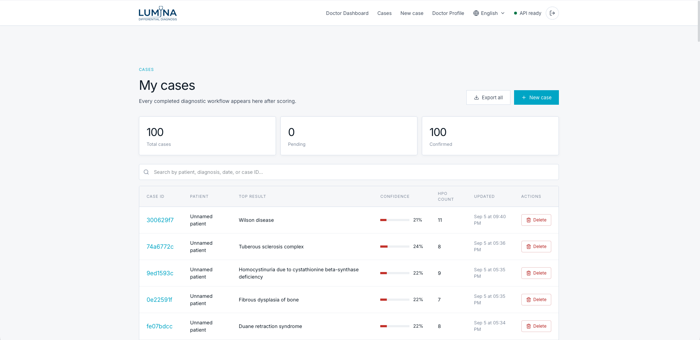
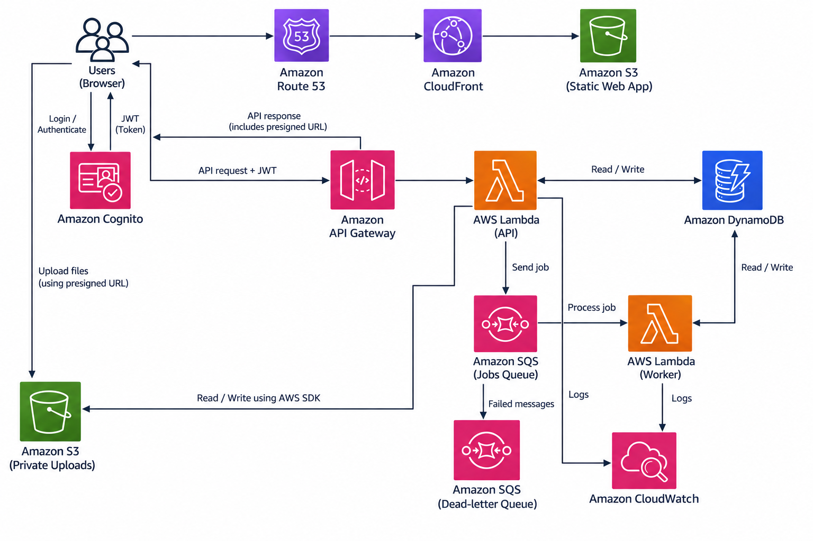

<div align="center">

# Lumina Differential Diagnosis

**Doctor-reviewed rare-disease triage, explainable phenotype ranking, and patient-safe referral generation on AWS.**

[](https://lumina-dd.online/en)
[](https://github.com/vees-1/lumina-aws/actions/workflows/ci.yml)
[](docs/aws-architecture.md)
[](infra/terraform)

</div>

> **Clinical safety:** Lumina is a research decision-support prototype, not a diagnostic system or medical device. Scores are relative evidence-match values—not disease probabilities—and all findings and patient-facing output require clinician review.

## Overview

Lumina helps clinicians turn unstructured patient evidence into a reviewable rare-disease differential. It combines clinical notes, photographs, laboratory reports, and genetic evidence; proposes Human Phenotype Ontology (HPO) terms; and ranks Orphanet diseases with a deterministic, explainable scoring engine.

The platform has separate doctor and patient workspaces:

- **Patients** submit evidence and see only information released by a doctor.
- **Doctors** review submissions, accept or reject extracted findings, run the differential, inspect scorecards, generate referral letters, and release approved results.
- **Role enforcement** occurs in both the interface and API. Cognito group claims distinguish doctor and patient accounts.

## Live services

| Component | Endpoint |
| --- | --- |
| Web application | [https://lumina-dd.online/en](https://lumina-dd.online/en) |
| CloudFront distribution | [https://d124bi3e327i7a.cloudfront.net/en](https://d124bi3e327i7a.cloudfront.net/en) |
| API health check | [https://twfg22gs48.execute-api.us-east-1.amazonaws.com/health](https://twfg22gs48.execute-api.us-east-1.amazonaws.com/health) |
| AWS region | `us-east-1` |

## Clinical workflow

1. A patient or doctor supplies one or more evidence modalities: notes, a clinical photo, a laboratory document, or genetic evidence.
2. The extraction layer proposes normalized HPO findings with a source and confidence. Explicitly absent findings use negative confidence.
3. A doctor reviews suggested findings. When review states are present, only terms marked `accepted` can enter scoring; pending and rejected terms are excluded.
4. The scoring API compares accepted findings with Orphanet disease–phenotype associations and separately evaluates disease–gene support.
5. Lumina returns the top 10 diseases with contributing, missing, distinguishing, and discordant findings for explanation.
6. The doctor can reopen the saved scorecard, prepare a referral letter/PDF, and release a patient-safe summary.

AI may assist evidence extraction and letter drafting, but disease ranking itself is deterministic once the accepted HPO terms and genetic evidence are fixed.

## How disease scoring works

The production implementation is in [`packages/scoring/ranker.py`](packages/scoring/ranker.py), with its HTTP boundary in [`apps/api/api/routes/score.py`](apps/api/api/routes/score.py).

### 1. Input filtering

- Unknown HPO IDs are removed.
- At least one positive HPO finding is required for a ranked result.
- If any term contains a review state, only `review_status="accepted"` terms are used.
- Positive confidence means a present finding; negative confidence means an explicitly absent finding.

### 2. HPO similarity and phenotype score

For every accepted positive patient term, the engine finds its best-matching phenotype for each disease:

```text
term_match = ontology_similarity(patient_HPO, disease_HPO)
             × Orphanet_frequency_weight
             × patient_term_confidence

phenotype_score = mean(best term_match for every positive patient term)
```

The ontology similarity is:

- **Lin similarity**, using the information content of the most informative common ancestor when IC data is available.
- **Jaccard similarity** over HPO ancestor sets when IC data is unavailable.
- Resnik information content is used internally to calculate Lin similarity.

Orphanet frequency labels are converted during ingestion:

| Orphanet frequency | Weight |
| --- | ---: |
| Obligate (100%) | `1.000` |
| Very frequent (99–80%) | `0.895` |
| Frequent (79–30%) | `0.545` |
| Occasional (29–5%) | `0.170` |
| Very rare (<4–1%) | `0.025` |
| Excluded (0%) | `0.000` |
| Missing/unknown label | `0.100` |

This means a close match to a characteristic phenotype contributes more than a match to a phenotype that is rarely associated with that disease.

### 3. Explicitly absent findings

An absent patient finding reduces support when it resembles a phenotype expected for the disease:

```text
negative_penalty = Σ(frequency_weight × ontology_similarity
                     × abs(patient_confidence) × 0.45)
                   / number_of_positive_terms

adjusted_phenotype_score = max(0, phenotype_score - negative_penalty)
```

The negative multiplier is **0.45**. Missing and distinguishing findings shown in the scorecard are explanatory fields; they do not add a second ranking adjustment.

### 4. Genetic evidence receives extra weight

Yes—genetics is deliberately weighted more heavily than an ordinary phenotype. Lumina first checks whether the submitted gene symbol is associated with the candidate disease in the Orphanet disease–gene table. The best matching item contributes this additive bonus:

| Classification for a matching gene | Label | Additive bonus |
| --- | --- | ---: |
| `pathogenic` or `likely_pathogenic` | strong | `+0.55` |
| `vus` | weak | `+0.12` |
| unknown/other | limited | `+0.08` |
| `benign` or `likely_benign` | none | `+0.00` |
| Gene not associated with disease | none | `+0.00` |

```text
evidence_score = min(1.0, adjusted_phenotype_score + genetic_bonus)
```

Only the highest matching genetic bonus is used for a disease; bonuses from multiple entries are not summed. Gene symbols are compared case-insensitively. The submitted variant, zygosity, inheritance, and source are retained as evidence metadata, but **they do not currently alter the numerical score**.

### 5. Ranking and displayed confidence

Diseases are sorted by `evidence_score` from highest to lowest. The response exposes both:

- `score`: combined phenotype and genetic evidence score from `0.0` to `1.0`.
- `phenotype_match`: phenotype score before the negative-finding adjustment, displayed on a `0–100` scale.

The displayed confidence/evidence strength uses an evidence-dependent ceiling:

| Genetic support | Confidence ceiling | Calculation |
| --- | ---: | --- |
| none | `40%` | `min(40, evidence_score × 40)` |
| limited or weak | `55%` | `min(55, evidence_score × 55)` |
| strong | `80%` | `min(80, evidence_score × 80)` |

Consequently, matching pathogenic or likely-pathogenic evidence has two effects: it adds `0.55` to the ranking score and raises the confidence ceiling from `40%` to `80%`. These percentages describe strength of evidence within Lumina; they are **not calibrated probabilities of diagnosis**.

For backward compatibility only, unreviewed legacy requests without genetic evidence use modality ceilings of `40%`, `55%`, `65%`, and `80%` for one through four modalities. The current doctor-reviewed path uses the evidence-dependent calculation above.

## Simulated 100-case benchmark

Lumina was evaluated through the authenticated doctor workflow using 100 synthetic clinical notes. Each case recorded the rank of its expected diagnosis in the returned differential. The synthetic notes did not contain gene names or embedded answer labels.



| Metric | Result |
| --- | ---: |
| Recall@1 | **96.0%** |
| Recall@3 | **97.0%** |
| Recall@5 | **98.0%** |
| Recall@10 | **98.0%** |
| Mean Reciprocal Rank (MRR) | **96.8%** |

- **Recall@k** is the proportion of evaluated cases where the expected diagnosis appeared within the first `k` returned results.
- **MRR** is the mean of `1 / rank` for the expected diagnosis across evaluated cases; higher values indicate that the expected diagnosis usually appeared near the top.
- A rank of `0` represents an expected diagnosis absent from the returned top 10. Blank ranks are excluded as unevaluated cases.

The complete case list, entered ranks, formulas, sources, and metric summary are available in the [100-case benchmark workbook](docs/benchmarks/lumina_100_clinical_notes_recall_mrr.numbers).

These results describe one controlled simulation and have not been independently reproduced or externally validated. They must not be interpreted as clinical accuracy, sensitivity, diagnostic performance, or evidence that Lumina is suitable for patient care.

## AWS architecture



| AWS service or asset | Responsibility |
| --- | --- |
| Route 53 | DNS for `lumina-dd.online`. |
| CloudFront + S3 | Global delivery of the statically exported Next.js application. |
| Amazon Cognito | Authentication, email confirmation, JWT issuance, and doctor/patient groups. |
| API Gateway | HTTPS API entry point and request routing. |
| AWS Lambda + FastAPI | Authorization, intake, scoring, case/submission lifecycle, PDF generation, and API responses. |
| DynamoDB | Cases, patient submissions, messages, profiles, and jobs using a single-table design and GSIs. |
| Private S3 uploads bucket | Encrypted photos and laboratory documents accessed through short-lived presigned URLs. |
| Amazon SQS + worker Lambda | Asynchronous extraction/scoring work and retry isolation. |
| CloudWatch | Runtime logs and operational visibility. |
| Bundled SQLite reference database | Read-only HPO hierarchy, information content, Orphanet diseases, phenotypes, and gene associations loaded into Lambda memory. |

See [the architecture notes](docs/aws-architecture.md) and [Terraform configuration](infra/terraform) for deployment details.

## Repository layout

```text
apps/web/                 Next.js static frontend
apps/api/                 FastAPI application and API tests
packages/extractors/      Notes, photo, lab, text-panel, and VCF extraction
packages/ingest/          HPO/Orphanet ingestion and reference models
packages/scoring/         Ontology similarity and deterministic ranker
infra/terraform/          AWS infrastructure as code
docs/                     Architecture notes and supporting assets
```

## Local development

Prerequisites: Node.js 20+, pnpm 9+, Python 3.13+, and [`uv`](https://docs.astral.sh/uv/).

```bash
# Install frontend dependencies from the repository root
pnpm install --frozen-lockfile

# Terminal 1: run the API in local/in-memory mode
cd apps/api
uv sync
LUMINA_AUTH_MODE=local uv run uvicorn main:app --reload

# Terminal 2: run the web application
cd apps/web
NEXT_PUBLIC_API_URL=http://localhost:8000 pnpm dev
```

Open `http://localhost:3000/en`.

Important environment variables include:

| Variable | Purpose |
| --- | --- |
| `NEXT_PUBLIC_API_URL` | Browser-visible API base URL. |
| `LUMINA_AUTH_MODE=local` | Enables local development identities and in-memory DynamoDB repository behavior. Do not use in production. |
| `LUMINA_DYNAMODB_TABLE` | DynamoDB table name in AWS. |
| `LUMINA_SQS_QUEUE_URL` | Optional asynchronous job queue. |
| `LUMINA_S3_BUCKET` | Private medical-evidence bucket. |
| `LUMINA_AI_PROVIDER` | Extraction/generation provider selection, including the zero-cost demo path. |

Use the checked-in `.env.example` files as the configuration reference. Never commit real credentials or patient data.

## Quality checks

The same commands run in GitHub Actions:

```bash
# Web
pnpm --filter web lint
pnpm --filter web typecheck
NEXT_PUBLIC_API_URL=http://localhost:8000 pnpm --filter web build

# API
cd apps/api
uv run ruff check .
uv run ruff format --check .
uv run pytest
```

## Security and data-handling boundaries

- API routes validate Cognito JWTs and enforce doctor/patient roles server-side.
- Patients cannot run clinical scoring or access raw doctor scorecards.
- Uploaded evidence remains in a private encrypted S3 bucket and is shared through expiring URLs.
- Patient submissions remain pending until a doctor reviews them; only doctor-released summaries and letters appear in the patient portal.
- DynamoDB is authoritative for persisted cases. Browser storage is a resilience cache and is reconciled with server state.
- Generated referrals remain editable and require clinician approval before release.

## License and disclaimer

Lumina is a research prototype for clinical decision support. It must not be used as a substitute for clinical judgment, validated diagnostic testing, or specialist consultation. All clinical decisions remain the responsibility of qualified healthcare professionals.
